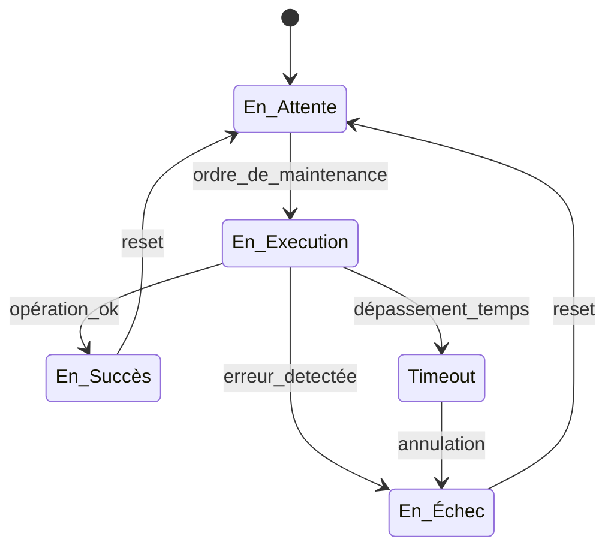

# Projet de Maintenance – Documentation Technique

## 1. Changements effectués et justification

### 🔧 1.1 Correctifs appliqués
- **Correction de la condition de transition entre les états "En Attente" et "En Exécution".**
  - *Justification :* une erreur logique empêchait la machine à états de lancer correctement le processus de maintenance.
  
- **Refactorisation du module de gestion des logs.**
  - *Justification :* amélioration de la lisibilité, homogénéité de structure et réduction de la duplication de code.

- **Ajout d’un mécanisme de timeout sur l’état "En Exécution".**
  - *Justification :* éviter le blocage permanent si aucune réponse n’était reçue du système supervisé.

### 🧩 1.2 Implémentation de machine à état
- **Switch enum**
- - *Example : * 
  ```c#
      public override void ExecuteState()
    {
        switch (operationsStates)
        {
            case OperationsStates.Waiting:
                ExecuteWaitingState();
            break;
            case OperationsStates.Queued:
                ExecuteQueuedState();
            break;
        }
      
    }
  ```
- **Table de transition**
- *Example : *
  ```c#
      private static readonly Dictionary<uint, Operations> PossibleOperations = new Dictionary<uint, Operations> { { 1, new AddBook() }, { 2, new DeleteBook() },{3,new BookInformations() },{ 4,new UpdateBookById()},{5,new ClearScreen() },{6,new Exit() } };
  ```
- **State Pattern**
- *Example : *
  ```c#
  PossibleOperations[operation]?.ExecuteState();
   public abstract class Operations
    {
        protected OperationsStates operationsStates;
        public abstract void ExecuteState();
    }
  ```

## 2. Diagramme de la machine à états



## 3. Sections critiques identifiées
- **Fonctions dans la class Database**
  - *Justification :* Toutes les fonctions qui ajoutent, modifient ou suppriment des livres constituent des sections critiques, car elles accèdent à des ressources partagées par l'essemble du programme.

 - **Fonctions dans la class Login**
  - *Justification :* Toutes les fonctions gérant la connexion ou la modification des informations d'utilisateur sont des sections critiques, car elles accèdent à des ressources partagée par plusieurs parties du code. 


## 4. Auteurs

- **Arnaud Simard-Desmeules** – Développeur   
- **Cedryk Leblanc** – Développeur 


