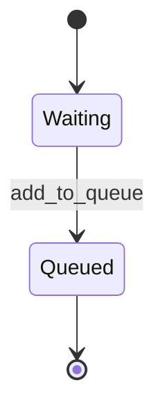

# Projet de Maintenance – Documentation Technique

## 1. Changements effectués et justification

### 1.1 CodeSmells
- **God Class**
- 


### 🧩 1.2 Implémentation de machine à état
- **Switch enum**
- Example :  
  ```c#
      public override void ExecuteState()
    {
        switch (operationsStates)
        {
            case OperationsStates.Waiting:
                ExecuteWaitingState();
            break;
            case OperationsStates.Queued:
                ExecuteQueuedState();
            break;
        }
      
    }
  ```
  - Justification : Le switch permet de choisir la methode à executer en fonction du state qui est un enum allant de Waiting a queue

- **Table de transition**
- Example : 
  ```c#
      private static readonly Dictionary<uint, Operations> PossibleOperations = new Dictionary<uint, Operations> { { 1, new AddBook() }, { 2, new DeleteBook() },{3,new BookInformations() },{ 4,new UpdateBookById()},{5,new ClearScreen() },{6,new Exit() } };
  ```
- Explication : Les operations possible sont toutes dans le memes dictionnary*
- **State Pattern**
- Example : 
  ```c#
  PossibleOperations[operation]?.ExecuteState();
   public abstract class Operations
    {
        protected OperationsStates operationsStates;
        public abstract void ExecuteState();
    }
    await foreach (var operation in TasksQueue.Reader.ReadAllAsync(cancellationToken))
    {
        operation.ExecuteState();
        await Task.Delay(100, cancellationToken);
    }
  ```
- Explication : Le code exécute l'interface operation qui a une methode executeState qui en fonction du state va éxecuter une action différente *
## 2. Diagramme de la machine à états



## 3. Auteurs


## 3. Sections critiques identifiées
- **Fonctions dans la class Database**
  - Justification : Toutes les fonctions qui ajoutent, modifient ou suppriment des livres constituent des sections critiques, car elles accèdent à des ressources partagées par l'essemble du programme.
  - Example :
    ```c#
    public static bool CheckPkExists(uint pk)
    {
        Program.logger.LogInformation($"Checking if {pk} exist in the database.");
        lock (_lockDatabase)
        {
            bool exists = _books.Any(book => book.Id == pk);

            if (exists)
            {
                Program.logger.LogInformation($"Primary key {pk} found in the database.");
            }
            else
            {
                Program.logger.LogWarning($"Primary key {pk} does not exist in the database.");
            }

            return exists;
        }
    }
    ```

 - **Fonctions dans la class Login**
  - Justification : Toutes les fonctions gérant la connexion ou la modification des informations d'utilisateur sont des sections critiques, car elles accèdent à des ressources partagée par plusieurs parties du code. 
 - *Example :*
    ```c#
    public static bool IsLoggedIn()
    {
        Program.logger.LogDebug("Checking login attempt.");
        lock (_lockLogin)
        {
            bool success = _users.Any(user =>
                string.Equals(user.UserName, userName, StringComparison.OrdinalIgnoreCase)
                && user.Password == passWord
            );

            if (success)
            {
                Program.logger.LogInformation($"Login successful for user: {userName}");
            }
            else
            {
                Program.logger.LogWarning($"Login failed for user: {userName}");
            }

            return success;
        }
    }
    ```

## 4. Auteurs

- **Arnaud Simard-Desmeules** – Développeur   
- **Cedryk Leblanc** – Développeur 


