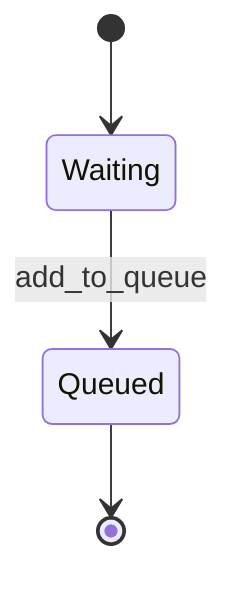

# Projet de Maintenance – Documentation Technique

## 1. Changements effectués et justification

### 🤢 1.1 CodeSmells
- **God Class** :  
  - **Explications** : Les classes database et program respectivement on trop de responsabilités  
  - **Solution** : Répartir le travail sur plusieurs classes dans le projet
- **Switch case** :  
  - **Explications** : Plusieurs classes contiennent des switch case trop long, cela rend le code peut maintenable et peu lisible  
  - **Solution** :  Implémentation d'une state machine dans le code
- **Side effect** :  
  - **Explication** : La methode IsLogged in de la classe login retournait un booléen loggedIn en même temps de regarder si les identifiants fournis par l'utilisateur sont correct, cela rend le code difficile a comprendre  
  - **Solution** : _isLoggedIn devient un champs privée de la classe Logged et la logique de régarder si les identifiants sont bon est mis dans la méthode CheckingLoginAttempt  
- **Data Class** :  
  - **Explication** : La classe credentials ne fait que contenir deux champs et ne fait rien d'autre  
  - **Solution** : Inclure la classe comme inline class dans la classe login
- **Duplicated Code** :
  - **Explication** : Certaine méthode ou nécéssité dans le code se ressemblais et avais des logiques très similaire
  - **Solution** : Nous les avons réunis dans des méthodes communes 

### 🧩 1.2 Implémentation de machine à état
- **Switch enum**
  - Example :  
  ```c#
      public override void ExecuteState()
    {
        switch (operationsStates)
        {
            case OperationsStates.Waiting:
                ExecuteWaitingState();
            break;
            case OperationsStates.Queued:
                ExecuteQueuedState();
            break;
        }
      
    }
  ```
   - Justification : Le switch permet de choisir la methode à executer en fonction du state qui est un enum allant de Waiting a queue

- **Table de transition**
  - Example : 
  ```c#
      private static readonly Dictionary<uint, Operations> PossibleOperations = new Dictionary<uint, Operations> { { 1, new AddBook() }, { 2, new DeleteBook() },{3,new BookInformations() },{ 4,new UpdateBookById()},{5,new ClearScreen() },{6,new Exit() } };
  ```
  - Explication : Les operations possible sont toutes dans le memes dictionnary*
- **State Pattern**
  - Example : 
  ```c#
  PossibleOperations[operation]?.ExecuteState();
   public abstract class Operations
    {
        protected OperationsStates operationsStates;
        public abstract void ExecuteState();
    }
    await foreach (var operation in TasksQueue.Reader.ReadAllAsync(cancellationToken))
    {
        operation.ExecuteState();
        await Task.Delay(100, cancellationToken);
    }
  ```
  - Explication : Le code exécute l'interface operation qui a une methode executeState qui en fonction du state va éxecuter une action différente *
## 2. Diagramme de la machine à états




## 3. Sections critiques identifiées
- **Fonctions dans la class Database**
  - Justification : Toutes les fonctions qui ajoutent, modifient ou suppriment des livres constituent des sections critiques, car elles accèdent à des ressources partagées par l'essemble du programme.
  - Example :
    ```c#
    public static bool CheckPkExists(uint pk)
    {
        Program.logger.LogInformation($"Checking if {pk} exist in the database.");
        lock (_lockDatabase)
        {
            bool exists = _books.Any(book => book.Id == pk);

            if (exists)
            {
                Program.logger.LogInformation($"Primary key {pk} found in the database.");
            }
            else
            {
                Program.logger.LogWarning($"Primary key {pk} does not exist in the database.");
            }

            return exists;
        }
    }
    ```
## 4. Auteurs

- **Arnaud Simard-Desmeules** – Développeur   
- **Cedryk Leblanc** – Développeur 


